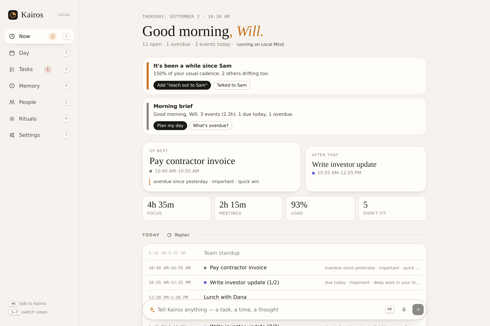
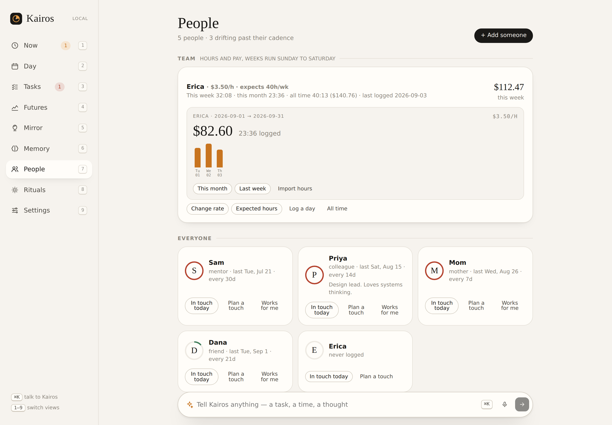
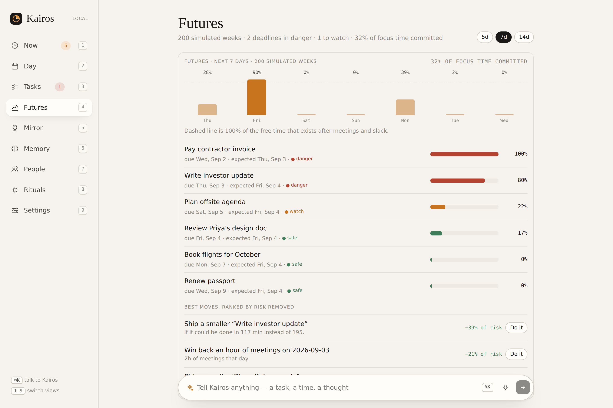
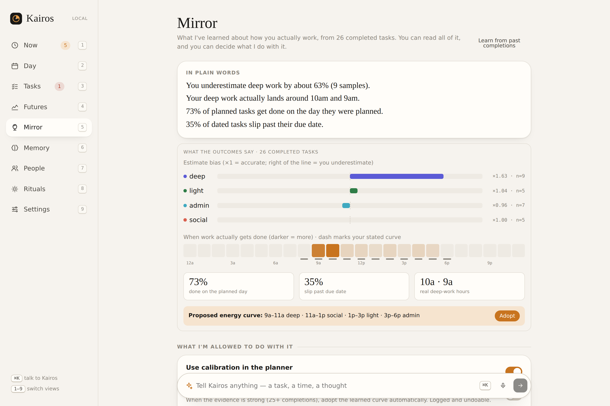
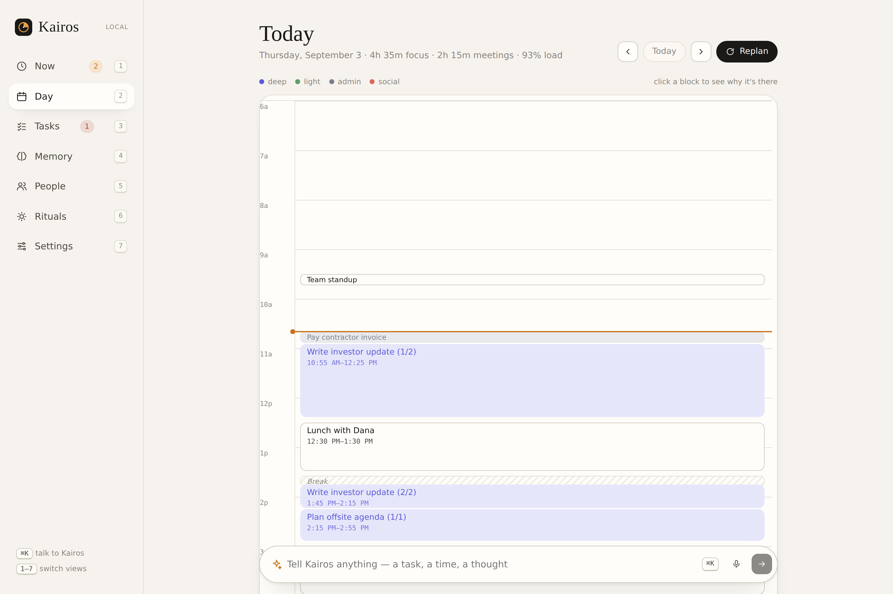
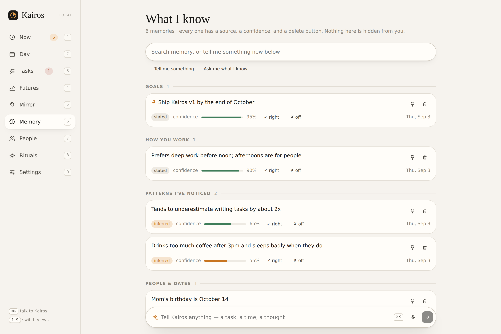
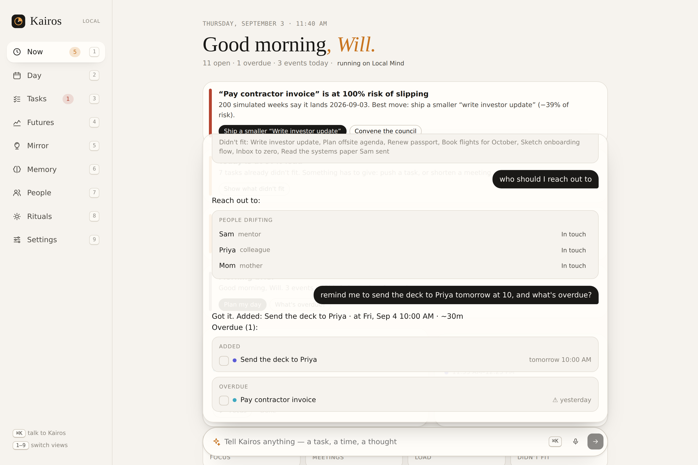
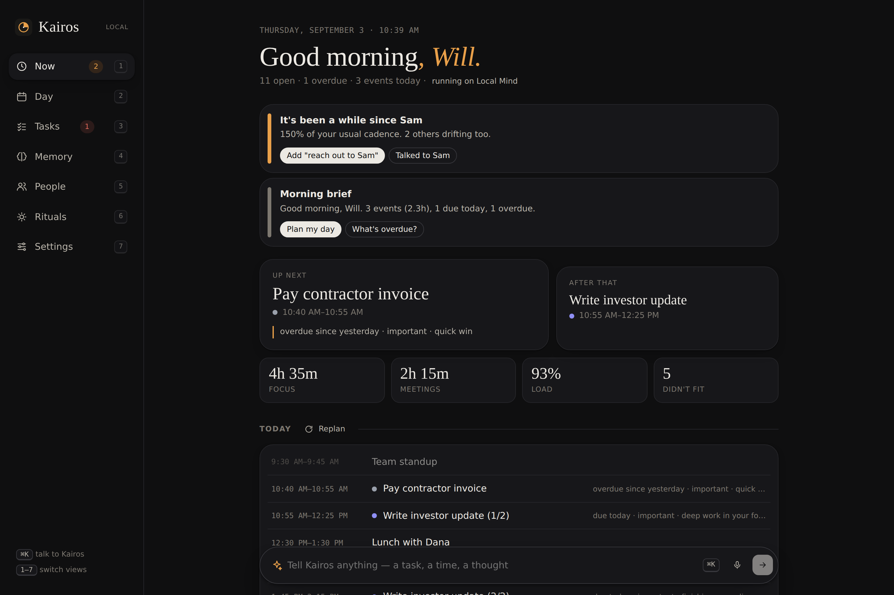
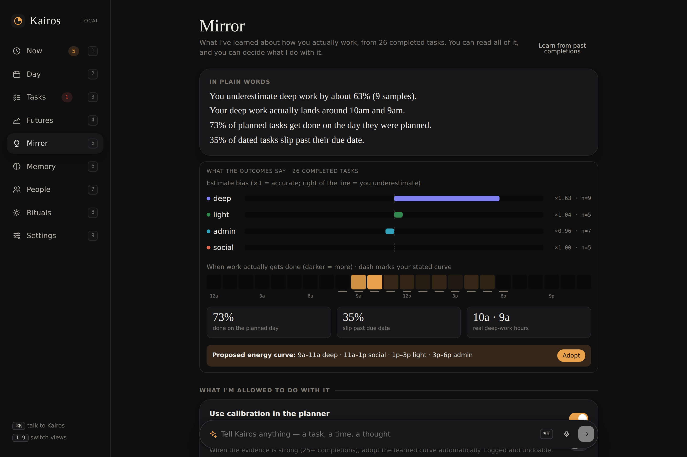
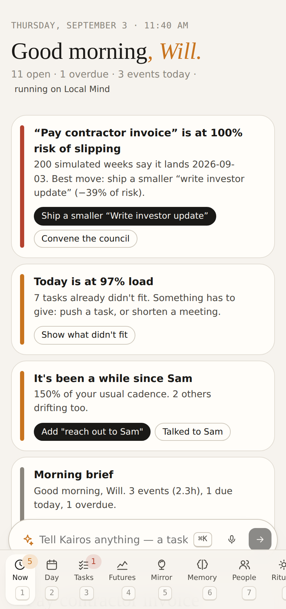

<p align="center">
  
</p>

<h1 align="center">Kairos</h1>

<p align="center"><em>A symbiotic personal intelligence.<br/>It runs your day, learns from every outcome, simulates your futures, deliberates before it advises, and shows you what it has learned about you.</em></p>

<p align="center">
  <a href="#quick-start">Quick start</a> ·
  <a href="#what-it-does">What it does</a> ·
  <a href="#two-brains">Two brains</a> ·
  <a href="docs/VISION.md">Why this exists</a> ·
  <a href="docs/ARCHITECTURE.md">Architecture</a>
</p>



---

## The bet

In five years the app most people open first every morning won't be a chat window or a to-do list. It'll be an **agent-first layer over your time**: one surface that knows your calendar, your commitments, your energy, and the people who matter, and that acts on them, on a schedule, without being asked.

Kairos is my version of that layer, built today. It is local-first, works with no model at all, and gets sharper the moment you give it one.

## Symbiosis

Most "AI assistants" are the same on day 300 as on day 1. Kairos is built around a loop that closes:

| Engine | What it does | Where you see it |
|---|---|---|
| **Learning** | Every completion becomes an outcome record. Kairos fits your estimate bias per kind of work, your real productive hours, plan adherence and slip rates, with priors that behave at 5 samples and at 5,000. The planner uses the learned model. | Mirror · plan blocks say “~90m by your history” |
| **Futures** | A seeded Monte Carlo over the coming days: calibrated durations, calendar capacity, interruption noise. Each deadline gets a probability of slipping; interventions are ranked by risk removed. | Futures · nudges · the realist on the council |
| **Council** | Strategist, realist, guardian, connector and editor each critique the week with evidence, then one synthesis and one decision. Deterministic critics offline; five parallel Claude perspectives plus a chair when a key is present. | Futures · `convene the council` |
| **Guardian + Ledger** | In Guardian mode Kairos defers low-priority work when a real deadline is at risk. Every autonomous action is logged with its reason and is one click to undo. It never scopes your work down for you. | Mirror · nudges |
| **Goals** | Goals the planner aligns to (goal-linked tasks get a bonus), with progress against elapsed time and a weekly focus share. | Futures · Tasks |
| **Reflection** | A nightly ritual turns what was learned into insight memories, so the model, the brief and the Mirror share one truth. | Memory · Rituals |

You control every part of it: calibration on or off, curve auto-tuning on or off, autonomy from “ask” to “guardian”. The Mirror is the product's conscience.

## Team and payroll

If people work for you, Kairos keeps their hours and what you owe them, and it connects to **OnlineJobs.ph Timeproof** three ways that all land in the same ledger:

- **Bookmarklet.** Settings → Connections gives you a “Send to Kairos” button. Drag it to your bookmarks bar, open a worker's Timeproof month, click. Day totals are read off the calendar (week and month totals are recognized and skipped) and pushed to your local Kairos with a private token. Re-running a month is idempotent and picks up corrections.
- **Paste.** Select the whole Timeproof calendar, copy, and say “import timeproof for Erica:” followed by the paste. The parser understands the calendar grid and tells day totals from week and month totals arithmetically.
- **Words.** “Erica's rate is 3.50/hr”, “Erica worked 7:04 on Aug 31”, “payroll for Erica this month”, “what do I owe Erica”, “team”.



Payroll weeks run Sunday to Saturday to match Timeproof. Rates are per person with a currency; the morning brief and weekly retro carry a Team line, the People view shows each worker's week, month and all-time, and a watcher speaks up from Thursday when a worker's week is running light against their expected hours.

| Futures | Mirror |
|---|---|
|  |  |

## What it does

**Plans your day, and tells you why.** The planner takes open tasks, fixed events and your personal energy curve and lays out a time-blocked day: deep work in your peak, admin in the trough, buffers around meetings, breaks after long focus, a slack reserve so the day isn't scheduled to 100%. Every block carries a reason ("due today · important · deep work in your focus window"). Click one and it explains itself.

**Understands you in plain language.** `call mom tomorrow at 5` becomes a pinned task. `submit the report by friday eod` becomes a deadline. `meeting with Sam and Priya next tue 3pm for 45 min` becomes an event with two people linked. `every weekday 8am journal` becomes a recurring task. This works offline; the parser is deterministic and covered by tests.

**Remembers with receipts.** Every memory has a kind (goal, preference, insight, relationship, fact, episode), a source (stated or inferred), a confidence, and the evidence it came from. Memories fade at different rates depending on kind. You can read all of it, pin it, correct it, or delete it. Nothing is hidden.

**Keeps your relationships alive.** People have a cadence. When someone drifts past it, Kairos notices and offers a one-click way back.

**Works while you're not looking.** Rituals run on a schedule: a morning brief (which also plans the day), an evening review, a weekly retro. Watchers fire between them: overdue tasks, drifting people, an overloaded day, an important deadline that isn't on the plan yet, a workday that started with no plan. Both land as nudges on the Now page with actions attached.

**Speaks in cards, not walls.** The agent returns structured UI: task lists, plans, briefs, decisions with options, checklists, metrics. Text is the garnish.

**Voice in, voice out.** Push-to-talk in the command bar and optional spoken replies, using the browser's own speech APIs.

**Yours.** One SQLite file. Export everything as JSON, import it anywhere. Installable as a PWA. MIT.

| Day view | Memory | Agent |
|---|---|---|
|  |  |  |

| Dark | Mirror, dark | Mobile |
|---|---|---|
|  |  |  |

## Two brains

Kairos has one set of capabilities and two brains that drive them.

**Local Mind** runs when there is no API key. It's an intent parser, a time parser, a planner and a memory engine. It doesn't chat, but it does the job: tasks, events, plans, briefs, memory, people, focus. Zero network.

**Claude** runs when you add an Anthropic API key (Settings, or `ANTHROPIC_API_KEY`). It uses the same tools through streaming tool use, with the person's context and memory profile in the system prompt, and adds judgment: it notices overload, splits ambiguous requests, writes memories with evidence as you talk, and holds a real conversation. If the API is unreachable, it falls back to Local Mind for that turn and says so.

Both brains share one tool registry, so anything one can do the other can do; the model just does it with taste.

## Quick start

Requires Node 22.13+ (built-in SQLite; no native modules) and pnpm.

```bash
pnpm install
pnpm dev          # server on :8787, web on :5173
```

Open http://localhost:5173. Onboarding asks for a name and timezone, offers a demo day, and takes an optional API key.

Production build:

```bash
pnpm build
pnpm start        # serves API + web on 127.0.0.1:8787
```

Docker (one container, one volume):

```bash
docker build -t kairos .
docker run --rm -p 8787:8787 -v kairos-data:/data -e ANTHROPIC_API_KEY=sk-ant-… kairos
```

Environment (all optional, see `.env.example`):

| Variable | Default | Meaning |
|---|---|---|
| `ANTHROPIC_API_KEY` | unset | Turns on the Claude brain |
| `KAIROS_DB` | `./data/kairos.db` | Where your life lives |
| `PORT` | `8787` | Server port |
| `HOST` | `127.0.0.1` | Bind address (`0.0.0.0` in containers) |
| `KAIROS_ALLOWED_ORIGINS` | localhost dev origins | Extra browser origins allowed to call the API |

## Talk to it

```
plan my day                         what's on tomorrow
remind me to renew my passport #admin !2 (40m) by the 15th
lunch with Dana friday 12-1 at Blue Bottle
block 9-11am tomorrow for deep work
done with the investor update       move dentist to next week
remember I do my best writing before noon
what do you know about my goals     forget that
met Priya, colleague from design, every 2 weeks
talked to Sam                       who should I reach out to
focus for 50 on the essay           evening review
goal: ship v1 by October            my goals
what's at risk                      convene the council
what have you learned about me      undo
Erica's rate is 3.50/hr             Erica worked 7:04 on Aug 31
import timeproof for Erica: <paste> payroll for Erica this month
what do I owe Erica                 team
```

Keyboard: `⌘K` or `/` focuses the command bar, `1–7` switch views, `Esc` collapses the thread.

## Scripts

```bash
pnpm dev        # both servers with hot reload
pnpm lint       # eslint (typescript-eslint + react-hooks)
pnpm test       # 152 tests: parser, planner, memory, learning, futures, council, goals, worklog/payroll, server, scheduler, hardening, migrations, regressions, mocked Claude brain
pnpm e2e        # browser smoke test against the production build (Chromium)
pnpm typecheck  # web + server
pnpm build      # web bundle + server transpile
pnpm check      # all of the above
```

## API

Everything the UI does goes through `/api`. Highlights:

- `POST /api/agent` — SSE stream of agent events (`start`, `text`, `thinking`, `tool_start`, `tool_end`, `card`, `mutation`, `done`)
- `POST /api/agent/sync` — same, buffered, for scripts and voice assistants
- `GET /api/plan?date=YYYY-MM-DD` · `POST /api/plan` — read or rebuild a day plan
- `GET /api/brief?kind=morning|evening|weekly`
- `GET /api/futures?days=7` — simulated risk report with interventions
- `POST /api/council` — deliberation (Claude perspectives or local critics)
- `GET /api/mirror` · `POST /api/mirror/adopt-curve` — the learned model and what to do with it
- `GET /api/ledger` · `POST /api/ledger/:id/undo` — autonomous actions, reversible
- CRUD on `/api/goals`
- `GET /api/team` · `GET /api/people/:id/payroll?period=` · `POST /api/worklog/import` (token-gated for foreign origins) — hours and pay
- `GET /api/stream` — live channel: nudges, rituals, mutations
- CRUD on `/api/tasks`, `/api/events`, `/api/memories`, `/api/people`, `/api/rituals`, `/api/watchers`, `/api/nudges`
- `GET /api/export` · `POST /api/import`

## Project shape

```
src/core     pure domain: types, chrono, intent, planner, memory, brief, rrule, cards,
             learning, simulate, council, goals
src/server   Hono + node:sqlite; repo, services, tools, two brains, scheduler, SSE
src/web      React + Vite PWA; design system, command bar, nine views
tests        vitest
docs         vision, architecture, screenshots
```

## Production notes

- Every write over HTTP is validated and bounded (`src/server/validate.ts`); bodies are capped at 2 MB (25 MB for import).
- The API key saved through the UI is encrypted at rest (AES-256-GCM; `KAIROS_SECRET` or a generated `.kairos-secret` file). Prefer `ANTHROPIC_API_KEY` in the environment for deployments.
- Daily JSON backups land next to the database (`backups/`, 14 kept). `POST /api/backup` makes one on demand.
- Requests are logged to stdout; the scheduler contains failures per ritual and watcher; `SIGTERM` closes the database cleanly.
- CI runs lint, typecheck, tests, build, a Chromium end-to-end smoke test, and a Docker build with a health probe.
- See [SECURITY.md](SECURITY.md) for the threat model and [CLAUDE.md](CLAUDE.md) for the layering rules.

## Status

v1.0.0. Single-user, local-first, no accounts. See [CHANGELOG](CHANGELOG.md). Calendar sync (CalDAV/Google), email triage, a native mobile shell and multi-device sync are the obvious next layers; the domain core is built so they slot in as adapters rather than rewrites.

MIT © 2026 Kairos contributors
